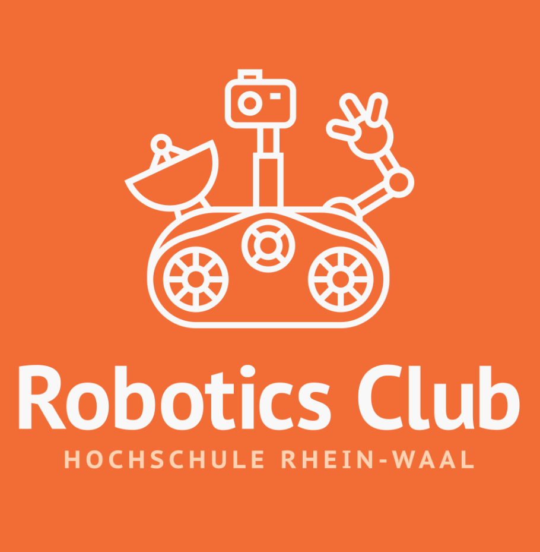

# Lecture Notes and Materials

 

### Welcome to Github repository of HSRW Robotic Club. You can find in here source codes, notebooks and relevant materials regarding the lecures we provide weekly.

### Content
## 1. [Week 1](week-1)
## 2. Week 2
**Week 1:**
- In this week, we start the first lecture in Python programming. Python is a high-level, interpreted and general-purpose dynamic programming language that focuses on code readability. It is one of the most three common programming languages in the worlds and is used by Google, Yahoo, NASA, Facebook, Amazon, Instagram, etc.
- We will use *Anaconda*, a free and open-source distribution of the Python. Depending on your operating system, you need to find the compatible Anaconda packages in [here](https://docs.anaconda.com/anaconda/install/).
- We recommend using the Spyder IDE for scripting your python codes, since it comes preinstalled with a ton of useful features.
- An awesome book for Python which we recommend is "Automated the Boring Stuff with Python". You can refer to the online version [here](https://automatetheboringstuff.com/) or download the pdf file [here](http://bit.ly/31zqrjP).
- For people who prefer learning with video, we recommend the 6 hours Python Tutorial for Beginners by Mosh [here](https://www.youtube.com/watch?v=_uQrJ0TkZlc).
- Agenda: 
    - Installing Anaconda Python
    - Datatypes: variables, input, strings, lists, dictionaries
    - Control Flow: if statements, while loop, for loop.

**Week 2:**
- Here we move on to more practical features of programming that make developing complex code much easier.
- Github ia very informative platform
- Agenda:
    - Functions and classes: Source code will be updated later.
    - Jupyter notebook: Python IDE that contains live code, equatios, visualization and narrative test. You can see an example in  [here](https://www.kaggle.com/vikrishnan/house-sales-price-using-regression).
    - Github: A hosting website for software development version control. [Homepage](https://github.com/)
    - Library: numpy, matplotlib, time, webrowser

# The end
